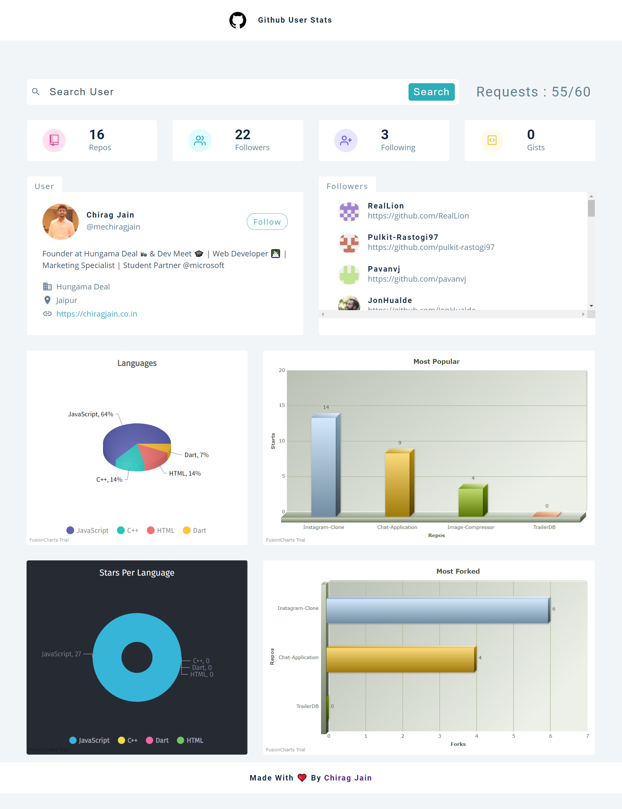

# Github User Stats

Search for the users and find out who are following them, used language pie chart, most popular repos and much more.

### Link - https://githubuserstats.netlify.app/

## 🏁 Sources

### Gihthub API

- [Root Endpoint](https://api.github.com)
- [Get User](https://api.github.com/users/mechiragjain)
- [Repos](https://api.github.com/users/mechiragjain/repos?per_page=100)
- [Followers](https://api.github.com/users/mechiragjain/followers)
- [Rate Limit](https://api.github.com/rate_limit)

### Fusion Charts

- [Fusion Charts - Main Docs](https://www.fusioncharts.com/)
- [List Of Charts](https://www.fusioncharts.com/dev/chart-guide/list-of-charts)
- [Themes](https://www.fusioncharts.com/dev/themes/introduction-to-themes)

### Deployed On

[Netlify](https://www.netlify.com/)

## 🏃‍ Local Installation

1. Drop a ⭐ on the Github Repository.
2. Clone the Repo by going to your local Git Client and pushing in the command:
https://github.com/mechiragjain/github-user-stats.git
3. At last, push in the command under client-user directory which will kickstart the application on Local Host:
npm start
